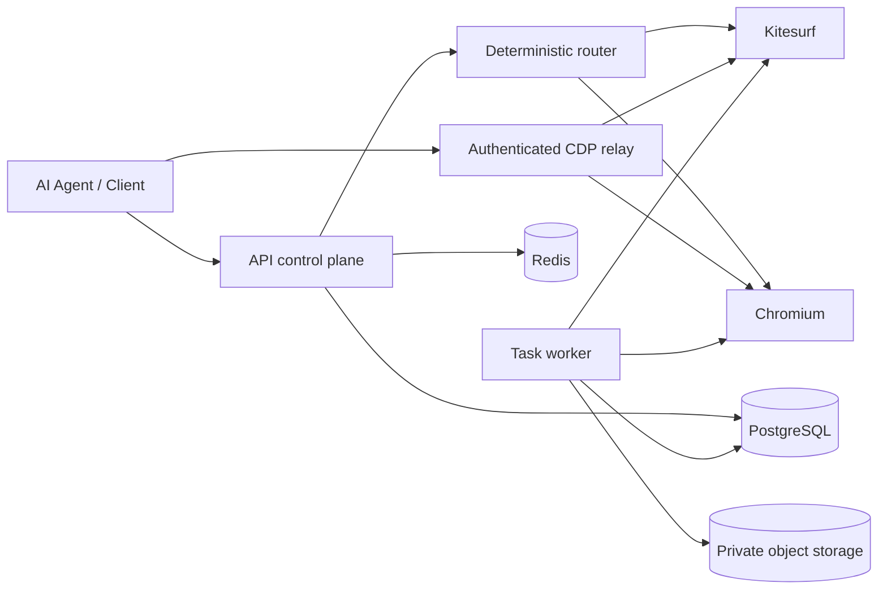

# SurfGate

SurfGate is a provider-neutral browser runtime router and control plane for AI agents.

> **Experimental Developer Preview** — built for development, research, and experimentation; not offered as a managed production service.

## What is SurfGate?

Clients ask for browser capabilities rather than choosing a provider directly. SurfGate validates the request, applies policy, and deterministically selects an eligible runtime.

```text
AI agent → SurfGate → Kitesurf
                    ↘ Chromium
```

Kitesurf is the lightweight path. Chromium is the broader compatibility path. Both sit behind the same tenant-scoped API, provider contract, and security boundary.

## Why SurfGate?

Not every browser workload necessarily needs a full Chromium runtime. SurfGate explores whether lighter runtimes can serve compatible workloads while preserving an explicit compatibility path for broader browser features. It makes no unsupported performance or cost guarantee.

## How it works



## Features

- Provider-neutral browser sessions and capability contracts
- Deterministic hard filtering, scoring, reason codes, and bounded allocation fallback
- Cloudflare Browser Run adapters for Kitesurf and Chromium
- Authenticated CDP relay that keeps provider credentials server-side
- Managed extract, screenshot, and PDF tasks
- PostgreSQL persistence, Redis coordination, and private artifact storage
- OpenTelemetry traces, metrics, and structured logs
- Tenant isolation, SSRF policy, redaction, resource limits, and provider conformance tests

## Quick Start

Requirements: Node.js 24, Corepack/pnpm 10.15.1, Docker Compose, and an S3-compatible private bucket when running the worker.

```bash
corepack enable
pnpm install --frozen-lockfile
cp .env.example .env
docker compose -f docker-compose.dev.yml up -d --wait
pnpm --filter @surfgate/api db:migrate
pnpm --filter @surfgate/api bootstrap:dev
pnpm dev
```

Before migration, put two distinct base64-encoded 32-byte development keys in `.env`. Live session allocation additionally needs Cloudflare credentials. See [Getting Started](docs/GETTING_STARTED.md) for the complete setup and safe key-generation commands.

## Example

```bash
curl --fail-with-body http://127.0.0.1:8080/v1/sessions \
  -H "Authorization: Bearer $SURFGATE_API_KEY" \
  -H "Idempotency-Key: first-session" \
  -H 'Content-Type: application/json' \
  --data '{"capabilities":{"javascript":"required","dom":"required"},"runtime":{"preference":"auto","allowFallback":true,"allowExperimental":false},"maxDurationSeconds":600}'
```

More copyable examples live in [`examples/`](examples/).

## Project Status

SurfGate is an experimental developer preview, not a production-readiness claim or contractual SLA. In particular, SurfGate **does not claim complete SSRF or network isolation for arbitrary raw CDP browser activity**. Untrusted raw-CDP deployments require independent egress controls or provider/browser request interception. Read the [security model](docs/SECURITY_MODEL.md) before enabling raw CDP.

## Documentation

- [Getting Started](docs/GETTING_STARTED.md)
- [User and API Guide](docs/USER_GUIDE.md)
- [Architecture](docs/ARCHITECTURE.md)
- [Routing](docs/ROUTING.md)
- [Providers](docs/PROVIDERS.md)
- [Security Model](docs/SECURITY_MODEL.md)
- [Operations](operations/observability.md) and [Runbooks](operations/runbooks.md)
- [Roadmap](ROADMAP.md)

The running API publishes its schema-derived OpenAPI document at `GET /openapi.json`.

## Contributing

Contributions are welcome. Start with [CONTRIBUTING.md](CONTRIBUTING.md) and report vulnerabilities through [SECURITY.md](SECURITY.md).

## License

SurfGate is licensed under [GNU AGPL v3.0 only](LICENSE). SPDX identifier: `AGPL-3.0-only`. Contributions are accepted under the same license.
