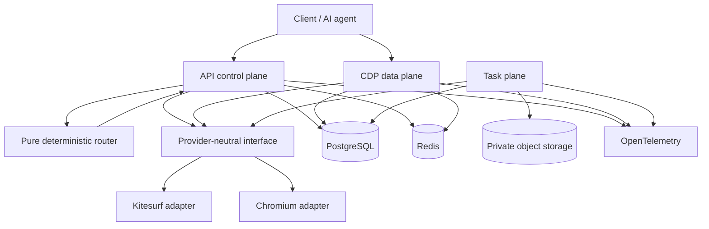

# Architecture

SurfGate separates browser selection, lifecycle control, long-lived CDP traffic, and managed task execution.



## Planes and boundaries

`apps/api` is the control plane. It authenticates API keys, validates and authorizes requests, enforces quotas and idempotency, invokes the router, allocates providers, persists sessions and routing decisions, and issues short-lived relay tokens.

`apps/relay` is the independently deployable data plane. It validates a relay credential and current session state before resolving protected provider connection metadata. It proxies bounded bidirectional WebSocket traffic without returning upstream URLs or credentials to clients.

`apps/worker` is the task plane. It claims durable task leases from PostgreSQL and executes bounded extract, screenshot, or PDF operations against an existing active session. Artifacts go to private object storage; their metadata goes to PostgreSQL.

## Router and providers

`packages/router` is pure domain logic: candidate construction, hard eligibility, deterministic scoring, explanations, and allocation-fallback classification. It does not import concrete provider packages, call a network, or allocate a browser.

`packages/provider-core` defines the lifecycle boundary. Kitesurf and Chromium implement it, while a private shared Cloudflare transport owns Cloudflare-specific API behavior. Kitesurf is a provider—not SurfGate's architectural core. Provider-neutral contracts let new runtimes participate without leaking vendor fields into the public API or router.

## Session lifecycle

```text
pending → routing → allocating → active → terminating → terminated
                         └→ fallback_allocating
terminal: terminated | expired | failed
```

Transitions use compare-and-set persistence. Allocation can fall back across runtimes at most once when the router classifies the pre-interaction failure as safe. After a session becomes active, its runtime identity never migrates.

## State and coordination

- **PostgreSQL:** tenants, hashed API-key metadata, sessions, routing decisions, idempotency, audit events, tasks, leases, and artifact metadata.
- **Redis:** distributed request-rate limits, relay connection ownership, and revocation signals. Security-sensitive operations fail closed when coordination cannot be proven.
- **Object storage:** private screenshot/PDF bytes. Public API responses contain bounded metadata, not base64 blobs or signed storage URLs.

## Observability

API, relay, and worker share `packages/observability`. OpenTelemetry traces follow synchronous and asynchronous boundaries, metrics use bounded labels, and structured logs use centralized recursive redaction. Audit records remain distinct durable business/security evidence.

Read [Routing](ROUTING.md), [Providers](PROVIDERS.md), [Security Model](SECURITY_MODEL.md), and [operations/observability.md](../operations/observability.md) next.
